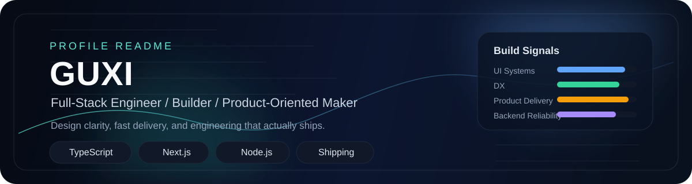

<p align="center">
  
</p>

<h2 align="center">Building polished products with strong engineering taste.</h2>

<p align="center">
  Full-Stack Engineer focused on interface quality, delivery speed, and systems that stay maintainable.
</p>

<p align="center">
  <a href="https://github.com/guxi0614">
    
  </a>
  <a href="https://guxi0614.cn">
    
  </a>
  <a href="mailto:3387839252@qq.com">
    
  </a>
</p>

<p align="center">
  
</p>

<table>
  <tr>
    <td width="56%" valign="top">

### Profile

```yaml
name: Guxi
role: Full-Stack Engineer
location: China
focus:
  - Product-minded frontend systems
  - Reliable backend and API design
  - Practical delivery over ornamental complexity
```

### Operating Style

- Clean interfaces with clear visual rhythm
- Fast iteration, fewer moving parts, sharper priorities
- Engineering choices that are easy to maintain after shipping

### Current Direction

- Building end-to-end products with React / Next.js / TypeScript
- Tightening UI quality, DX, and structure
- Keeping product execution fast without sacrificing reliability

    </td>
    <td width="44%" align="center" valign="top">
      
      <br /><br />
      
      
      
      
    </td>
  </tr>
</table>

<table>
  <tr>
    <td width="50%" valign="top">

### Build Signals

```text
TypeScript         40%  ########....
React / Next.js    24%  ######......
Node.js APIs       18%  ####........
Python tooling     10%  ###.........
UI / DX polish      8%  ##..........
```

### Notes

> Code with taste. Build with purpose. Ship work that still feels good to maintain.

    </td>
    <td width="50%" valign="top">

### Design Priorities

- Strong contrast and a deliberate visual hierarchy
- Components that feel intentional, not generic
- A portfolio presence that reads like a product, not a template

### Links

- Website: [guxi0614.cn](https://guxi0614.cn)
- GitHub: [@guxi0614](https://github.com/guxi0614)
- Email: [3387839252@qq.com](mailto:3387839252@qq.com)

    </td>
  </tr>
</table>

### Visual

<p align="center">
  
</p>

### Metrics

<p align="center">
  
  
</p>

### Toolbox

<p align="center">
  
  
  
  
  
  
  
  
  
  
  
</p>

### Contribution Flow

<p align="center">
  <picture>
    <source media="(prefers-color-scheme: dark)" srcset="https://raw.githubusercontent.com/guxi0614/guxi0614/output/github-contribution-grid-snake-dark.svg" />
    <source media="(prefers-color-scheme: light)" srcset="https://raw.githubusercontent.com/guxi0614/guxi0614/output/github-contribution-grid-snake.svg" />
    
  </picture>
</p>

<p align="center">
  
</p>
